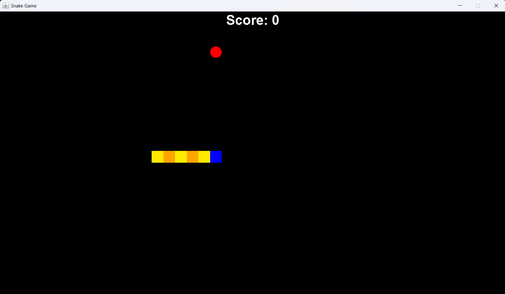

# Snake Game Documentation



## Overview

Welcome to the classic Snake game, a simple yet addictive creation in Java where players control a snake to navigate a grid, consume food, and grow longer. The goal is to achieve the highest score without colliding with the snake's own body or the game borders.

## Features

### 1. Snake Movement

The player controls the snake using arrow keys. The snake moves continuously in the current direction until a change in direction is prompted.

### 2. Food Consumption

Randomly placed food items appear on the game grid. When the snake consumes a food item, it grows longer, and the player's score increases.

### 3. Collision Detection

The game checks for collisions between the snake and its own body or the game borders. A collision results in the end of the game, and the player's score is displayed.

### 4. Score Tracking

The game keeps track of the player's score, which is based on the number of food items consumed. The higher the score, the more proficient the player is at maneuvering the snake.

### 5. Game Over

The game concludes when the snake collides with itself or the borders. The final score is displayed.

## How to Play

1. **Snake Movement**: Use arrow keys (Up, Down, Left, Right) to navigate the snake.
2. **Food Consumption**: Direct the snake to eat the randomly placed food items to grow.
3. **Score Tracking**: Your score increases with each consumed food item.
4. **Collision**: Avoid collisions with the snake's own body or the game borders.
5. **Game Over**: The game ends when a collision occurs. The final score is displayed.
6. **Restart**: After the game concludes, players can restart for a new round.

## Sample Code

```java
// Sample code snippet for handling snake movement
//checks if snake touches it's own body
		for(int i=bodyParts;i>0;i--) {
			if((x[0] == x[i]) && y[0] == y[i]) {
				running=false;
			}
		}
		
		//check if snake's head touches the left border
		if(x[0] < 0)
			running=false;
		
		//check if snake's head touches the right border
		if(x[0] > SCREEN_WIDTH)
			running=false;
		
		//check if snake's head touches top border
		if(y[0] < 0)
			running=false;
		
		//check if snake's head touches bottom border
		if(y[0] > SCREEN_HEIGHT)
			running=false;
		
		if(!running)
			timer.stop();
